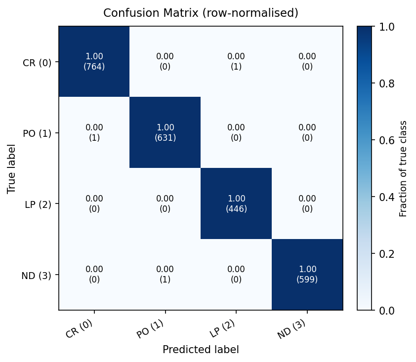
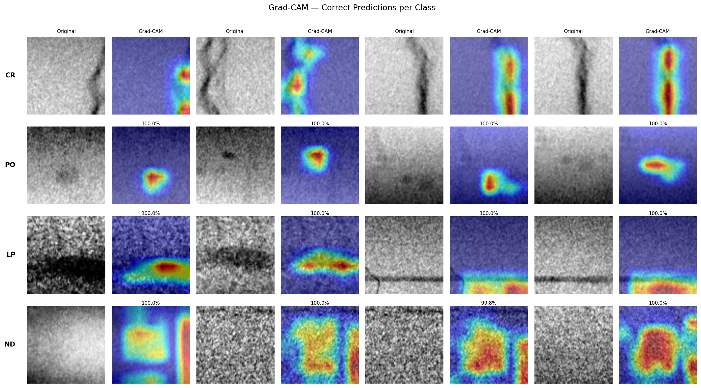

# Weld Defect Classification on RIAWELC

Klassifikation von Schweißnaht-Defekten in Röntgenbildern mit ResNet50 und Transfer Learning.

---

## Datensatz

**RIAWELC** — Radiographic Images for Automatic Weld defects CLassification  
Quelle: [github.com/stefyste/RIAWELC](https://github.com/stefyste/RIAWELC)  
Lizenz: Frei verfügbar (für akademische Nutzung)

| Eigenschaft | Wert |
|---|---|
| Bilder gesamt (einzigartig) | 21.964 |
| Auflösung | 224 × 224 px, 8-bit Grayscale PNG |
| Klassen | 4 (CR, PO, LP, ND) |
| Split | Training / Validation / Testing (vordefiniert) |

**Klassen:**
| Kürzel | Name | Beschreibung | Patches (gesamt) |
|---|---|---|---|
| CR | Cracks / Risse | Scharfe, lineare Helligkeitsunterschiede | 6.870 (31%) |
| PO | Porosity / Poren | Runde, dunkle Gaseinschlüsse | 5.688 (26%) |
| LP | Lack of Penetration | Unvollständige Durchschweißung, an der Nahtwurzel | 4.006 (18%) |
| ND | No Defect | Defektfreie Schweißnaht | 5.400 (25%) |

> **Hinweis zur Datenqualität:** Der originale `testing/`-Ordner enthält 2.443 Patches, die byte-identisch auch in `training/` vorkommen. `build_clean_splits()` entfernt diese Duplikate aus dem Trainings-Set, sodass der Test-Split ein echter Hold-out ist (Train ∩ Test = ∅).

**Wichtige Erkenntnisse aus der Exploration:**
- Leicht unbalanciert (CR 1.7× häufiger als LP), kein dramatisches Ungleichgewicht
- Pixelstatistiken (Training-Split): mean = 0.602, std = 0.195 — Bilder generell hell
- Kritische Verwechslungspaare: CR↔LP (beide lineare Strukturen)

---

## Methode

### Modell: Transfer Learning mit ResNet50

[ResNet50](https://arxiv.org/abs/1512.03385) (He et al., CVPR 2016) vortrainiert auf ImageNet als Backbone. Zwei Anpassungen für unsere Domäne:
- **conv1**: 3 RGB-Kanäle → 1 Graustufenkanal (Röntgenbilder sind einkanalig)
- **fc**: 1000 ImageNet-Klassen → 4 Defektklassen

Training in zwei Phasen: erst nur den neuen Classifier-Kopf trainieren (Backbone eingefroren, 10 Epochen), dann das gesamte Netz feinabstimmen (20 Epochen, niedrige LR um vortrainierte Features nicht zu überschreiben).

### Verlustfunktionen

- **[Cross-Entropy Loss](https://pytorch.org/docs/stable/generated/torch.nn.CrossEntropyLoss.html)** (gewichtet): Standard-Klassifikationsverlust. Klassen erhalten inverse Frequenzgewichte, damit die häufigste Klasse (CR) den Gradienten nicht dominiert.
- **[Focal Loss](https://arxiv.org/abs/1708.02002)** (Lin et al., ICCV 2017, γ=2): Variante von Cross-Entropy, die einfach korrekt klassifizierte Samples dämpft — FL(p_t) = −(1−p_t)^γ · log(p_t). Fokussiert das Training auf schwierige Grenzfälle.

### Optimierung

- **[AdamW](https://pytorch.org/docs/stable/generated/torch.optim.AdamW.html)** (Decoupled Weight Decay, [Loshchilov & Hutter, 2019](https://arxiv.org/abs/1711.05101)): Wie Adam, aber L2-Regularisierung ist vom adaptiven Schrittweitenterm entkoppelt — stabiler beim Finetuning vortrainierter Modelle.
- **[CosineAnnealingLR](https://pytorch.org/docs/stable/generated/torch.optim.lr_scheduler.CosineAnnealingLR.html)**: Senkt die Lernrate nach einem Kosinusverlauf von lr_max bis ~0. Kein abruptes Abfallen, das Modell konvergiert sanft ins Minimum.
- **[Mixed Precision (AMP fp16)](https://pytorch.org/docs/stable/amp.html)**: Aktivierungen in fp16, Master-Gewichte in fp32 — halbierter VRAM-Verbrauch bei gleichem Ergebnis.
- **Gradient Clipping** (max_norm=1.0): Verhindert explodierende Gradienten beim Full-Finetuning.

### Data Augmentation

Nur im Training angewendet, nicht bei Validation/Test (wo echte, unveränderte Performance gemessen wird):

| Transformation | Begründung |
|---|---|
| RandomHorizontalFlip / RandomVerticalFlip | Röntgen-Patches haben kein natürliches „oben" — Spiegelung ist verlustfrei |
| RandomRotation (±15°) | Simuliert leichte Kamerawinkelabweichungen |
| ColorJitter (Helligkeit/Kontrast ±20%) | Simuliert verschiedene Röntgenbelichtungen und Scanner-Kalibrierungen |

### Erklärbarkeit: Grad-CAM

[Grad-CAM](https://arxiv.org/abs/1610.02391) (Gradient-weighted Class Activation Mapping, Selvaraju et al., ICCV 2017) visualisiert, welche Bildregionen das Modell für seine Entscheidung nutzt: Gradienten der Zielklasse bezüglich der letzten Feature Map (`backbone.layer4[-1]`) werden global gemittelt, als Gewichte auf die Feature Maps angewendet und hochskaliert. Für industrielle ZfP entscheidend: der Prüfer kann nachvollziehen, *warum* das Modell „Riss" sagt — und ob es tatsächlich auf den Riss schaut oder auf ein Bildartefakt.

### Trainingsläufe

Drei Runs mit [PyTorch Lightning](https://lightning.ai/docs/pytorch/stable/) + [Weights & Biases](https://wandb.ai):

| Run | Loss | Backbone | Epochen | Ergebnis |
|---|---|---|---|---|
| run_1_baseline | CE | eingefroren | 10 | Baseline |
| run_2_finetune | CE | aufgetaut | 20 | **bestes Modell** |
| run_3_focal | Focal (γ=2) | aufgetaut | 20 | vergleichbar |

---

## Ergebnisse

[](https://api.wandb.ai/links/alexanderf/y12yfubc)

Evaluierung von `run_2_finetune` auf dem bereinigten Test-Split (2.443 Patches):

| Klasse | Precision | Recall | F1 |
|---|---|---|---|
| CR | 0.999 | 0.999 | 0.999 |
| PO | 0.998 | 0.998 | 0.998 |
| LP | 0.998 | 1.000 | 0.999 |
| ND | 1.000 | 0.998 | 0.999 |
| **Macro** | **0.999** | **0.999** | **0.999** |

**Gesamt-Accuracy: 99,88%** (2.440/2.443 korrekt, 3 Fehlklassifikationen)



Grad-CAM-Analyse zeigt, dass das Modell konsistent die physikalisch relevanten Bildregionen aktiviert (Risslinien bei CR, kreisförmige Einschlüsse bei PO, Nahtwurzel-Bereich bei LP):



---

## Setup & Reproduktion

**Voraussetzungen:** `uv` und Python 3.12

Für das Training wird eine GPU empfohlen:
- **Lokal:** NVIDIA GPU mit min. 4 GB VRAM (entwickelt und getestet auf GTX 1650 Ti / 4 GB)
- **Cloud:** z.B. [Kaggle](https://kaggle.com) mit kostenloser T4 GPU — das Notebook unter `notebooks/kaggle_training.ipynb` ist dafür vorbereitet

```bash
# Repository klonen
git clone <repo-url>
cd ndt-defect-classification

# Python 3.12 Umgebung erstellen und Dependencies installieren
uv venv --python 3.12 .venv
uv sync

# Datensatz herunterladen (24.407 Bilder, ~1.5 GB nach Extraktion)
git clone https://github.com/stefyste/RIAWELC data/RIAWELC
cd data/RIAWELC/Dataset_partitioned
unrar x RIAWELC_dataset.part01.rar ../images/
```

**Datenexploration:**
```bash
uv run python notebooks/01_data_exploration.py
# Plots → outputs/plots/
```

**Training** (lokal oder auf Kaggle):
```bash
uv run python -m src.train run_1_baseline   # Baseline: CE, Backbone eingefroren
uv run python -m src.train run_2_finetune   # Finetuning: CE, volles Netz
uv run python -m src.train run_3_focal      # Focal Loss, volles Netz
```

**Evaluation** (benötigt Checkpoint unter `outputs/models/finetune-ce-unfrozen/best.ckpt`):
```bash
uv run python -m src.evaluate
# → outputs/plots/confusion_matrix.png
# → outputs/plots/classification_report.png
# → outputs/plots/confidence_distribution.png
# → outputs/evaluation_results.json
```

**Grad-CAM:**
```bash
uv run python -m src.gradcam
# → outputs/plots/gradcam_per_class.png
# → outputs/plots/gradcam_errors.png
```

---

## Limitierungen

- **Patch-Klassifikation, keine Lokalisierung:** Das Modell klassifiziert vorgeschnittene 224×224-Patches. Auf einem Vollbild-Röntgenbild ist unklar, *wo* sich der Defekt befindet — dafür wäre ein Detection-Modell (z.B. YOLO, Faster R-CNN) nötig.

- **Begrenzte Datendiversität:** Die 21.964 Patches stammen aus nur 29 Schweißstücken, aufgenommen unter kontrollierten Bedingungen an einer Anlage. Hohe Accuracy auf diesem Split ist kein Beweis für Generalisierung auf andere Materialien, Wandstärken, Röntgenanlagen oder Operatoren. Für industriellen Einsatz wären Daten aus mehreren Anlagen und Produktionsumgebungen nötig.

- **Nur Radiografie (RT):** Dieses Modell ist ausschließlich auf Röntgenbilder zugeschnitten. Industrielle ZfP verwendet viele weitere Verfahren — Ultraschall (UT/PAUT), Wirbelstrom (ET), Magnetpulver (MT) u.a. — die völlig andere Signalcharakteristiken haben und separate Modelle erfordern würden.

- **Keine Unsicherheitsquantifizierung:** Das Modell gibt Softmax-Wahrscheinlichkeiten aus, die nicht kalibriert sind. Ein Konfidenzwert von 95% bedeutet nicht zwingend, dass das Modell in 95% solcher Fälle recht hat.

---

## Referenzen

[1] Totino, Spagnolo, Perri. *RIAWELC: A Novel Dataset of Radiographic Images for Automatic Weld Defects Classification.* ICMECE 2022.

[2] Perri, Spagnolo, Frustaci, Corsonello. *Welding Defects Classification Through a Convolutional Neural Network.* Manufacturing Letters, Elsevier.

[3] He et al. [*Deep Residual Learning for Image Recognition.*](https://arxiv.org/abs/1512.03385) CVPR 2016.

[4] Lin et al. [*Focal Loss for Dense Object Detection.*](https://arxiv.org/abs/1708.02002) ICCV 2017.

[5] Selvaraju et al. [*Grad-CAM: Visual Explanations from Deep Networks via Gradient-based Localization.*](https://arxiv.org/abs/1610.02391) ICCV 2017.

[6] Loshchilov & Hutter. [*Decoupled Weight Decay Regularization.*](https://arxiv.org/abs/1711.05101) ICLR 2019.
